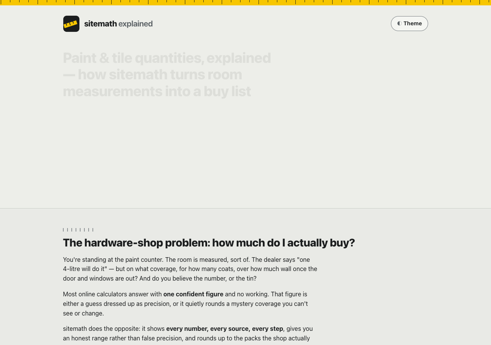

# sitemath explained — how the paint & tile quantity calculator works

**An animated, single-page walkthrough of [sitemath](https://sreenivas-sadhu-prabhakara.github.io/sitemath/):
how room measurements become a buy-this-much material list — net paintable area, an honest
min–max litres range from a cited coverage band, real tins/bags/boxes, and tile counts with
wastage — every coefficient shown, cited and overridable, entirely in your own browser.**



- **This explainer:** https://sreenivas-sadhu-prabhakara.github.io/sitemath-explained/
- **The live app it explains:** https://sreenivas-sadhu-prabhakara.github.io/sitemath/
  ([app source](https://github.com/Sreenivas-Sadhu-Prabhakara/sitemath))

## What's on the page

An animated 4-scene walkthrough of one real room — a 4.0 × 3.0 m room, 3.0 m high, with a door
and a window, ceiling included — carried end to end:

1. **Measure the room** — walls are `2 × (L + W) × H`; door and window areas come off the *wall*
   total only; the ceiling is `L × W` and is never reduced by an opening. (42.00 m² gross wall −
   3.33 m² openings = **38.67 m² net wall**; +12.00 m² ceiling.)
2. **Divide by a cited coverage band** — an economy interior emulsion cited at **130–150 sq.ft/L
   for 2 coats** (Asian Paints Tractor Emulsion PIS) gives an honest **2.77–3.20 L** range, not one
   fake-precise number. The worst case uses the band's *lowest* coverage.
3. **Round up to real packs** — the pack-fill minimizer rounds the worst-case litres up the real tin
   ladder (1/4/10/20 L), choosing the least total volume that still covers the need, then the fewest
   tins, then the larger tin: here, **one 4 L tin**.
4. **Tiles** — 12.00 m² floor in 600 × 600 mm tiles at 5% straight-lay wastage is **35 tiles** in
   exact integer-mm math (one round-up), then **9 boxes of 4 with 1 spare**.

Plus: **every coefficient is cited and overridable** (verified / beta / convention / your-value),
**quantities only — never prices**, the **enforced-privacy** section, a feature tour, honest limits
and an FAQ.

The bars grow, tins snap in, and the tape blade extends on scroll (pure CSS + inline SVG, no
libraries — the CSP forbids external and inline script). Every scene has a **Replay** button.
`prefers-reduced-motion` collapses every animation to its final, fully legible state. Light and dark
themes are both WCAG-AA; everything is keyboard-operable.

## Quickstart

No build step, no dependencies.

```sh
git clone https://github.com/Sreenivas-Sadhu-Prabhakara/sitemath-explained.git
cd sitemath-explained
open index.html        # or serve statically: python3 -m http.server 8000
```

Run the self-tests (Node 20+):

```sh
node --test
```

The tests in `test/facts.test.js` re-derive every quantity asserted on the page — using the same
formulas the live sitemath engine uses — so the page can't drift from the math:

- area (gross wall, opening deductions off walls only, ceiling `L × W`, net wall floored at 0),
- the coverage band → per-coat m²/L conversion and the min–max litres range,
- the pack-fill minimizer (least total ≥ need → fewest packs → larger pack), with a property test
  over every centilitre from 0.01–60.00 L proving it always covers and never overshoots by a whole
  largest pack,
- integer-mm tile counts with a single round-up, and box-of-N with spares.

## Privacy

Same guarantee as the app it explains: this page ships a strict Content-Security-Policy with
`connect-src 'none'`, so **the browser itself blocks every network request**. No server, no account,
no analytics, no external fonts, scripts or images — everything is same-origin or a `data:` URI. The
only thing stored is your theme choice, in this browser's `localStorage`.

## Disclaimer

This explainer and sitemath are informational estimating aids provided **"as is"**, without warranty
of any kind. They are **not professional advice, a site survey, or a quotation**. Quantities are
**estimates for ideal, properly prepared surfaces**, derived from manufacturer-published coverage
bands; real consumption varies with surface porosity, texture, thinning and application method.
**Buy against the worst-case figure** and confirm quantities with your painter or contractor before
purchase. sitemath reports quantities only — never prices. The author accepts no liability for
decisions made using these tools.

## License

[MIT](LICENSE) © 2026 Sreenivas Sadhu Prabhakara
